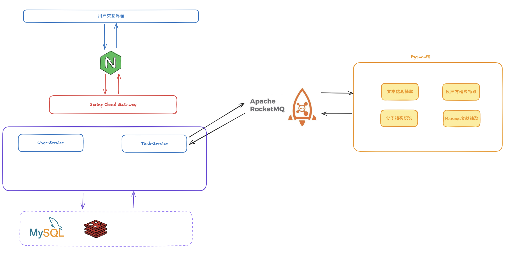

# Dev - 持续更新中
# 化学文献多模态信息抽取平台-Java侧
该项目为化学文献多模态信息抽取平台-Java侧，包含以下功能:  
1. 实现用户的注册、登录、修改密码、找回密码等功能
2. 实现多模态抽取中任务创建，任务管理，任务查询，任务删除等功能
3. Java侧与Python端功能通过消息队列进行交互
## 注意
1. 注册的时候用户名全剧唯一，密码加密后存储到MySQL。

## 项目开发简介
1. 基于JDK17+SprigBoot3进行开发，支持SpringCloud进行路由动态转发  
2. 设计技术：SpringBoot、SpringCloud、MySQL、Redis、RabbitMQ、Nginx

## SQL资源
位于 /source/sql

## 整体框架

