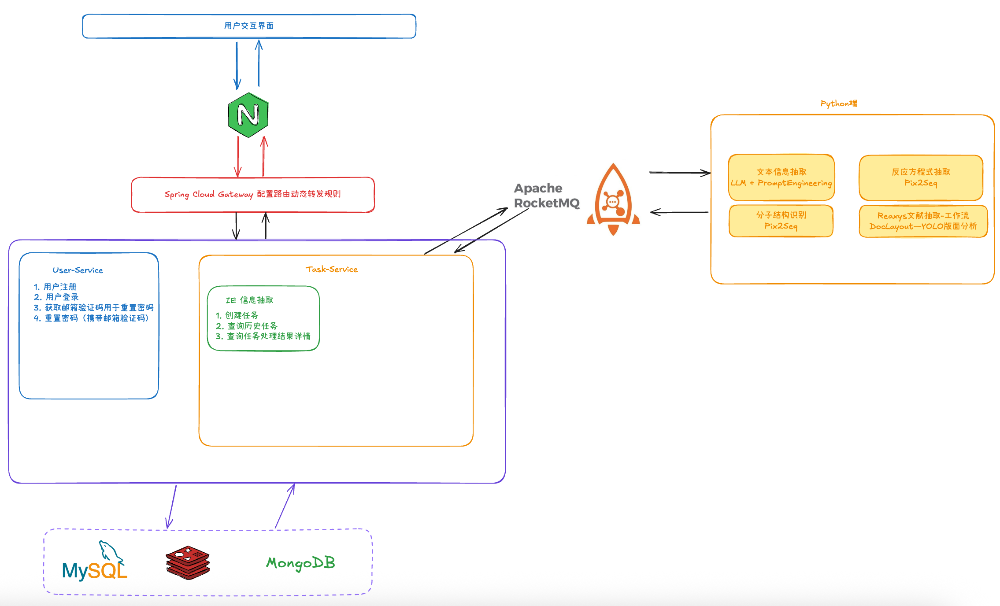

# Dev - 持续更新中
2025.3.30 新增邮件找回密码的功能-先调用接口获取验证码，然后请求另外一个接口更新新密码。  
2025.3.29 增加Task，引入MongoDB，引入MQ，完善雪花算法，MongoDB和MQ暂时未封装。MongoDB 和MQ通过 - Docker拉取部署 - 框架基本形成。

# 化学文献多模态信息抽取平台-Java侧
该项目为化学文献多模态信息抽取平台-Java侧，包含以下功能:  
1. 实现用户的注册、登录、修改密码、找回密码等功能
2. 实现多模态抽取中任务创建，任务管理，任务查询，任务删除等功能
3. Java侧与Python端功能通过消息队列进行交互

## 项目开发简介
1. 基于JDK17+SprigBoot3进行开发，支持SpringCloud进行路由动态转发  
2. 设计技术：SpringBoot、SpringCloud、MySQL、Redis、RabbitMQ、Nginx

## SQL资源
位于 /source/sql

## 整体框架

## 注意
### 用户名全剧唯一（为了支持用户名密码登录，防止重名登录错账号）
实现思路：注册的时候先利用布隆过滤器判断用户名是否已经存在。  
如果不存在，说明未注册，则正常注册。  
如果存在，但是可能存在误判，所以进一步检查RedisSet里面是否是真的存在这个元素，如果不存在，正常注册。  
否则，跑出异常，当前用户已经注册。  
并且在正常注册时，防止多个用户同时注册一个用户名，使用Redisson添加分布式锁防止资源竞争。

